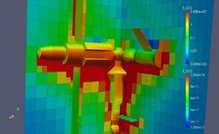

:orphan:

.. index:: adapt_grid

.. _adapt-grid:

.. _adapt-grid-command:

##################
adapt_grid command
##################

.. _adapt-grid-syntax:

*******
Syntax:
*******

::

   adapt_grid group-ID action1 action2 style args ... keyword args ...

- group-ID = group ID for which grid cells adaptation will be attempted on

- action1 = *refine* or *coarsen*

- action2 = *coarsen* or *refine*, optional

- style = *particle* or *surf* or *value* or *random*

::

   *particle* args = rthresh cthresh
   rcount = threshold in particle count for refinment
   ccount = threshold in particle count for coarsening
   *surf* arg = surfID ssize
   surfID = group ID for which surface elements to consider
   ssize = do not refine to create cells smaller than ssize (dist units)
   coarsen only if child cells are smaller than ssize (dist units)
   *value* args = c_ID/c_ID\[N\]/f_ID/f_ID\[N\] rthresh cthresh
   c_ID = ID of a compute that calculates a per grid vector, use values from vector
   c_ID\[N\] = ID of a compute that calculates a per grid array, use values from Nth column of array
   f_ID = ID of a fix that calculates a per grid vector, use vector
   f_ID\[N\] = ID of a fix that calculates a per grid array, use Nth column of array
   rvalue = threshold in value for refinement
   cvalue = threshold in value for coarsening
   *random* args = rfrac cfrac
   rfrac = fraction of child cells to refine
   cfrac = fraction of parent cells to coarsen

- zero or more keyword/args pairs may be appended

- keyword = *iterate* or *maxlevel* or *minlevel* or *thresh* or *combine* or *cells* or *region* or *dir*

::

   *iterate* arg = niterate
   niterate = number of iterations of action loop
   *maxlevel* arg = Nmax
   Nmax = do not refine to create child cells at a level > Nmax
   *minlevel* arg = Nmin
   Nmin = do not coarsen to create child cells at a level < Nmin
   *thresh* args = rdecide cdecide
   rdecide = *less* or *more* = refine when value is less or more than rvalue
   cdecide = *less* or *more* = coarsen when value is less or more than cvalue
   *combine* arg = *sum* or *min* or *max* = how to combine child values into parent value
   *cells* args = Nx Ny Nz
   Nx,Ny,Nz = refine a cell into Nx by Ny by Nz child cells
   *region* args = regID rflag
   regID = ID of region that cells must be inside to be eligible for adaptation
   rflag = *all* or *one* or *center* = what portion of grid cell must be inside
   *dir* args = Sx Sy Sz
   Sx,Sy,Sz = vector components used with style *surf* to test surf elements
   *file* arg = filename
   filename = name of file to write out with new parent grid info

.. _adapt-grid-examples:

*********
Examples:
*********

::

   adapt_grid all refine particle 50 10
   adapt_grid all coarsen particle 50 10
   adapt_grid all refine coarsen particle 50 10
   adapt_grid all refine surf all 0.15 iterate 1 dir 1 0 0 
   adapt_grid all refine coarsen value c_1\[1\] 5.0 10.0 iterate 2

.. _adapt-grid-descriptio:

************
Description:
************

This command perform a one-time adaptation of grid cells within a grid
cell group, either by refinement or coarsening or both.  This command
can be invoked as many times as desired, before or between simulation
runs.  Grid adaptation can also be performed on-the-fly during a
simulation by using the :ref:`fix adapt<fix-adapt>` command.

Refinement means splitting one child cell into multiple new child
cells.  The original child cell disappears, conceptually it becomes a
parent cell.  Coarsening means combining all the child cells of a
parent cell, so that the child cells are deleted and the parent cell
becomes a single new child cell.  See :ref:`Section howto 4.8<howto-details-grid-geometry-sparta>` for a description of the hierarchical
grid used by SPARTA and definitions of child and parent cells.

Grid adaptation can be useful for adjusting the grid cell sizes to the
current density distribution, or mean-free-path of particles, or to
other simulation attributes such as the presence of surface elements.
A well-adapted grid can improve accuracy of the simulation and/or
reduce a simulation's computational cost.

.. note::

  that the grid group assignment is transferred to
  new refined or coarsened cells, so that new cells remain eligible for
  adaptation if the adapt_grid command is invoked again or successive
  adaptations are performed via the :ref:`fix adapt<fix-adapt>` command.

.. note::

  that cells which are
  refined by *action1* are not eligible for subsequent coarsening by
  *action2*, during a single invocation of this command.  Likewise cells
  that are coarsened by *action1* are not eligible for subsequent
  refinement by *action2*.  This is also true if the *iterate* keyword
  is used to loop over the two actions multiple times.  Cells can be
  successivly refined on each iteration, but will never be coarsened.
  Likewise cells can be successivly coarsensed, but will never be
  refined.  Of course any cell may be refined or coarsened later if the
  adapt_grid command is used again, including on later timesteps via the
  :ref:`fix adapt<fix-adapt>` command.

Examples of 2d and 3d refined grids are shown here.  The 3d simulation
shows 2d planar cuts through the 3d grid.  Click on either image for a
larger version.

The first step in a refinement action is to determine what child cells
are eligible for refinement.  Child cells that are wholly inside a
closed surface are not eligible.  The *maxlevel* and *region* keywords
also affect eligibility.  They are described below.

The first step in a coarsening action is to determine what parent
cells are eligible for coarsening.  Only parent cells whose children
are all child cells are eligible.  If one or more of their children
are also parent cells, then the parent cell is a "grandparent" and is
not eligible for coarsening.  The *minlevel* and *region* keywords
also affect eligibility.  They are described below.

.. note::

  that for refinement,
  the number of new child cells created withing a single cell is set by
  the *cells* keyword which defaults to 2x2x2 for 3d models and 2x2x1
  for 2d models.

.. note::

  that many of the style take an argument for both refinement and
  coarsening, e.g. *rcount* and *ccount* for style *particle*.  Both
  arguments must be specified, though one or the other will be ignored
  if the specified actions do not include refinement or coarsening.

.. note::

  that
  if you wish to use time-averaged counts of particles in each cell you
  should use the *value* style with the ID of a :ref:`fix   ave/grid<fix-ave-grid>` command that time-averages particle counts
  from the :ref:`compute grid<compute-grid>` command.

The *surf* style adapts only if a grid cell contains one or more
surface elements in the specified *surfID* group.  The *dir* keyword
can be used to exclude additional surface elements.  For refinement,
the cell is refined unless the refinement will create child cells with
any of their dimensions smaller than the specified *ssize*.  For
coarsening, the parent cell is coarsened only if any of the child cell
dimensions is smaller than the specified *ssize*.

The *value* style uses values calculated by a :ref:`compute<compute>`
or :ref:`fix<fix>` to decide whether to adapt each cell.  The fix or
compute must calculate per-grid values as described in :ref:`Section howto 4.4<howto-output-sparta-(stats,-dumps,>`.  If the compute or fix calculates a
vector of such values, it is specified as c_ID or f_ID.  If it
calculates an array of such values, it is specified as c_ID\[N\] or
f_ID\[N\] when N is the column of values to use, from 1 to Ncolumns.

For refinement, if the compute or fix value for the grid cell is
"more" than *rvalue*, the cell is refined.  For coarsening, if the
"sum" of the compute or fix values in all child cells of the parent
cell is "less" than *cvalue*, the parent cell is coarsened.  The
*thresh* keyword can be used to change the refinment or coarsening
criteria to "less" versus "more".  Likewise the *combine* keyword can
be used to change the "sum" of child cell values to be a "min" or
"max" operation.

Here is an example using particle count as calculated by the :ref:`compute grid<compute-grid>` command as an adaptation criterion.  A cell
will be refined if its count > 25, and a parent cell coarsened if
the sum of its children cell counts < 10.

::

   compute 1 grid all n nrho
   adapt_grid refine coarsen value c_1\[1\] 25 10

The same thing could be accomplished with this command:

::

   adapt_grid refine coarsen particle 25 10

These commands use a time-averaged particle count as an adaptation
criterion in the same manner:

::

   compute 1 grid all n nrho
   fix 1 ave/grid 10 100 1000 c_1\[1\]
   run 1000    # run to accumulate time averages
   adapt_grid refine coarsen value f_1\[1\] 25 10

.. note::

  the use of "thresh less more" to refine
  when MFP is less than the specified threshold (0.05).

::

   compute 1 lambda/grid f_1\[2\] NULL N2 kall
   adapt_grid refine coarsen value c_1\[2\] 0.05 0.1 &
   combine min thresh less more

The *random* style is provided for test and debugging purposes.  For
each cell eligible for adaptation, a uniform random number RN bewteen
and 1.0 is generated.  For refinement, the cell is refined if RN <
*rfrac*, so that approximately an *rfrac* fraction of the child cells
are refined.  Similarly, for coarsening, the parent cell is coarsened
if RN < *cfrac*, so that approximately a *cfrac* fraction of the
parent cells are coarsened.

Various optional keywords can also be specified.

.. note::

  that the compute used with style
  *value* will be recalculated at each iteration to accurately reflect
  per grid values for the current grid.

The *maxlevel* keyword limits how far a grid cell can be refined.  See
:ref:`Section howto 4.8<howto-details-grid-geometry-sparta>` for a definition of the
level assigned to each parent and child cell.  Child cells with a
level >= *Nmax* are not eligible for refinement.  The default setting
of *Nmax* = 0 means there is no limit on refinement.

The *minlevel* keyword limits how far a grid cell can be coarsened.
See :ref:`Section howto 4.8<howto-details-grid-geometry-sparta>` for a definition of
the level assigned to each parent and child cell.  Parent cells with a
level < *Nmin* are not eligible for coarsening.  The default setting
of *Nmin* = 1 means the only limit on coarsening is that the first
level grid is preserved (never coarsened to a single root cell).  The
specified *Nmin* must be >= 1.

The *thresh* keyword is only used by style *value*.  It sets the
comparison criterion for refinement as *rdecide* = *less* or *more*.
This means a child cell is refined if its compute or fix value is
*less* or *more* than *rvalue*.  Similarly, it sets the comparison
criterion for coarsening as *cdecide* = *less* or *more*.  This means
a parent cell is coarsened if the compute or fix value accumulated
from the compute or fix values of its children is *less* or *more*
than *cvalue*.

The *combine* keyword is only used by style *value*.  It determines
how the compute or fix value for a parent cell is accumulated from the
compute or fix values of all its children.  If the setting is *sum*,
the child values are summed.  If it is *min* or *max*, the parent
value is the minimum or maximum of all the child values.

The *cells* keyword determines how many new child cells are created
when a single grid cell is refined.  Nx by Ny by Nz new child cells
are created.  *Nz* must be one for 2d.  Any of Nx, Ny, Nz may have a
value of 1, but they cannot all be 1.

.. note::

  that
  the *side* option for the :ref:`region<region>` command can be used to
  define whether the inside or outside of the geometric region is
  considered to be "in" the region.

The grid cell must be in the region to be eligible for adaptation.
The *rflag* setting determines how a grid cell is judged to be in the
region or not.  For *rflag* = *one*, it is in the region if any of its
corner points (4 for 2d, 8 for 3d) is in the region.  For *rflag* =
*all*, all its corner points must be in the region.  For *rflag* =
*center*, the center point of the grid cell must be in the region.

The *dir* keyword is only used by the style *surf*.  The Sx,Sy,Sz
settings are components of a vector.  It's length does not matter,
just its direction.  Only surface elements whose normal is opposed to
the vector direction (in a dot product sense) are eligible surfaces
for the adapation procedure described above for the *surf* style.
This can be useful to exclude refinement around surface elements that
are not facing "upwind" with respect to the flow direction of the
particles.  This is accomplished by setting Sx,Sy,Sz to the flow
direction.  If Sy,Sy,Sz = (0,0,0), which is the default, then no
surface elements are excluded.

.. note::

  that no file is written if no grid cells are refined or
  coarsened.

If the filename contains a "\*" wildcard character, then the "\*" is
replaced by the current timestep.  This is useful for the :ref:`fix adapt<fix-adapt>` command, if you wish to write out multiple grid
files, each time the grid iadapts.

If the grid is partitioned across processors in a "clumped" manner
before this command is invoked, it will still be clumped by processor
after the adaptation.  Likewise if it is not clumped before, it will
remain un-clumped after adaptation.  See :ref:`Section howto 4.8<howto-details-grid-geometry-sparta>` for a description clumped and
unclumped grids.

If you want the grid partitioning (and their particles) to be
rebalanced across processors after grid adaptation, you can use the
:ref:`balance_grid<balance-grid>` command after this command.

.. _adapt-grid-restrictio:

*************
Restrictions:
*************

This command can only be used after the grid has been created by the
:ref:`create_grid<create-grid>`, :ref:`read_grid<read-grid>`, or
:ref:`read_restart<read-restart>` commands.

Currently a fix cannot be used with style *value* for *iterate* > 1.
This is because the per-grid cell values accumulated by the fix are
not interpolated to new grid cells so that the fix can be re-evaluated
multiple times.  In the future we may revove this restriction.

Currently, if there are custom attributes defined for grid cells, grid
adaptation does not set new values for new grid cells created when
either refinement or coarsening takes place.  The new cells will have
zero values for their attributes.  This is because there is no simple
way to determine how new attribute values should be computed.  This
may be changed in the future.

.. _adapt-grid-related-commands:

*****************
Related commands:
*****************

:ref:`fix adapt<fix-adapt>`, :ref:`balance_grid<balance-grid>`

.. _adapt-grid-default:

********
Default:
********

The keyword defaults are iterate = 1, minlevel = 1, maxlevel = 0,
thresh = more for rdecide and less for cdecide, combine = sum, cells =
2 2 for 3d and 2 2 1 for 2d, no region, dir = 0 0 0, and no file.

