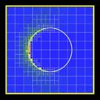

:orphan:

.. index:: compute_distsurf_grid

.. _compute-distsurf-grid:

.. _compute-distsurf-grid-command:

#############################
compute distsurf/grid command
#############################

.. _compute-distsurf-grid-kk-command:

################################
compute distsurf/grid/kk command
################################

.. _compute-distsurf-grid-syntax:

*******
Syntax:
*******

::

   compute ID distsurf/grid group-ID surf-ID keyword args ...

- ID is documented in :ref:`compute<compute>` command 

- distsurf/grid = style name of this compute command

- group-ID = group ID for which grid cells to perform calculation on

- surf-ID = group ID for which surface elements to consider

- zero or more keyword/args pairs may be appended

- keyword = *dir*

::

   *dir* args = Sx Sy Sz
   Sx,Sy,Sz = direction vector used to test surf elements

.. _compute-distsurf-grid-examples:

*********
Examples:
*********

::

   compute 1 distsurf/grid all all
   compute 1 distsurf/grid subset sphere2 dir 1 0 0

.. _compute-distsurf-grid-descriptio:

************
Description:
************

Define a computation that calculates the minimum distance from each
grid cell in a grid cell group to any surface element in a surface
element group.  This is useful for grid adaptation; the
:ref:`adapt_grid<adapt-grid>` command can use the compute as a
criterion for refining or coarsening individual grid cells.

Only grid cells in the grid group specified by *group-ID* are included
in the calculation.  See the :ref:`group grid<group>` command for info
on how grid cells can be assigned to grid groups.  Only surface
elements in the surface element group specified by *surf-ID* are
included in the distance calculations.  See the :ref:`group surf<group>` command for info on how surface elements can be
assigned to surface element groups.

If the *dir* keyword is specified it can exclude additional surface
elements.  The Sx,Sy,Sz settings are components of a vector.  It's
length does not matter, just its direction.  Only surface elements
whose normal is opposed to the vector direction (in a dot product
sense) are eligible surfaces for the distance calculations.  This can
be useful to exclude surface elements that are not facing "upwind"
with respect to the flow direction of the particles.  I.e.  by setting
Sx,Sy,Sz to the flow direction.  If Sy,Sy,Sz = (0,0,0), which is the
default, then no surface elements are excluded by this criterion.

Each grid cell also only considers a subset of eligible surfaces in
its distance calculations.  A vector from the grid cell center to the
center of each surface element is calculated.  If that vector is
opposed to the normal vector of the surface element (in a dot product
sense), the distance from the grid cell to the surface is calculated.
This means that for an individual grid cell, only surface elements
that are "facing" the grid cell are considered.

The "distance" between a grid cell and a surface element is the
minimum distance between the two geometric entities.  If the surface
element overlaps with the grid cell, the distance is 0.0.  Otherwise
the distance is the minimum distance between the perimeter of the grid
cell and the line segment (in 2d) or the perimeter of the triangle (in
3d).

Here is an example of using this compute with the
:ref:`adapt_grid<adapt-grid>` command to adapt the grid around the
upwind side of a circular object (flow is from the left boundary of
the box).  The first adapt_grid command uses a threshold distance
value of 0.5 to create refine grid cells once.  The second adapt_grid
command uses a threshold distance value of 0.1 to create some of the
grid cells closer to the surface a second time.

.. note::

  include pic

Here is an example of how to use this compute with two successive
"adapt_grid" commands.  The first refines once for grid cells within a
distance of 0.3 from surface elements facing upwind.  The second
refines again for grid cells within a distance of 0.1 from the surface
elements.

::

   compute 5 distsurf/grid all all dir 1 0 0
   adapt_grid all refine value c_5 0.3 0.0 thresh less more
   adapt_grid all refine value c_5 0.1 0.0 thresh less more

For a 2d simulation of flow around a circle (flow from right to left),
these commands produce this kind of adapted grid (click for a larger
image):

.. _compute-distsurf-grid-output-info:

************
Output info:
************

This compute calculates a per-grid vector whose values are the
distances of each grid cell from any of the surface elements.

This compute performs calculations for all flavors of child grid cells
in the simulation, which includes unsplit, cut, split, and sub cells.
See :ref:`Section 6.8<howto-details-grid-geometry-sparta>` of the manual gives
details of how SPARTA defines child, unsplit, split, and sub cells.

Grid cells not in the specified *group-ID* will output zeroes for all
their values.

The vector can be accessed by any command that uses per-grid values
from a compute as input.  See :ref:`Section 6.4<howto-output-sparta-(stats,-dumps,>`
for an overview of SPARTA output options.

The per-grid array values for the vector will be in distance
:ref:`units<units>`.

Styles with a *kk* suffix are functionally the same as the
corresponding style without the suffix.  They have been optimized to
run faster, depending on your available hardware, as discussed in the
:ref:`Accelerating SPARTA<accelerate>` section of the manual.
The accelerated styles take the same arguments and should produce the
same results, except for different random number, round-off and
precision issues.

These accelerated styles are part of the KOKKOS package. They are only
enabled if SPARTA was built with that package.  See the :ref:`Making SPARTA<start-making-sparta-optional-packages>` section for more info.

You can specify the accelerated styles explicitly in your input script
by including their suffix, or you can use the :ref:`-suffix command-line switch<start-running-sparta>` when you invoke SPARTA, or you can
use the :ref:`suffix<suffix>` command in your input script.

See the :ref:`Accelerating SPARTA<accelerate>` section of the
manual for more instructions on how to use the accelerated styles
effectively.

.. _compute-distsurf-grid-restrictio:

*************
Restrictions:
*************

None

.. _compute-distsurf-grid-related-commands:

*****************
Related commands:
*****************

:ref:`adapt_grid<adapt-grid>`

.. _compute-distsurf-grid-default:

********
Default:
********

The keyword default is dir = 0,0,0.

