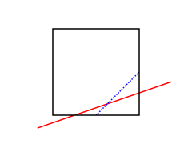
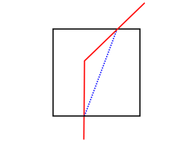
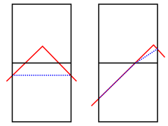

:orphan:

.. index:: create_isurf

.. _create-isurf:

.. _create-isurf-command:

####################
create_isurf command
####################

.. _create-isurf-syntax:

*******
Syntax:
*******

::

   create_isurf group-ID ablateID thresh mode ...

- group-ID = grid ID for which grid cells to perform calculation on 

- ablateID = ID of a :ref:`fix ablate<fix-ablate>` command

- thresh = threshold for corner values used to generate implicit surfaces, value > 0.0 and < 255.0

- mode = *inout* or *ave*

::

   *inout* = mark corner points as either inside or outside surf
   *ave* = smooth values by averaging expected corner point values based on intersections between the explicit surfaces and cell edges

.. _create-isurf-examples:

*********
Examples:
*********

::

   create_isurf all fablate 40.0 inout
   create_isurf subset fablate 100.0 ave

.. _create-isurf-descriptio:

************
Description:
************

This command converts all currently defined explicit surface elements
to implicit surface elements.  One motivation for this operation is
that implicit surfaces can be ablated over time via the :ref:`fix ablate<fix-ablate>` command.  See the :ref:`How to 6.13<howto-surface-elements:-explicit,-implicit,>` section of the manual for an
explantion of explicit versus implicit surfaces.

Explicit surface elements are triangles in 3d or line segments in 2d.
They are enumerated in a file, read by the :ref:`read_surf<read-surf>`
command.  Implicit surface elements are also triangles or line
segments.  However each element is contained within a single grid
cell.

A related command which defines implicit surfaces is the
:ref:`read_isurf<read-isurf>` command which reads a file of corner point
values defined on a 2d or 3d grid, which is mapped to (a portion of)
the SPARTA grid.  It then calculates appropriate implicit line
segments or triangles within each grid cell based on its 4 or 8 corner
points.  See the :ref:`read_isurf<read-isurf>` command for details.

This command derives the 2d or 3d grid of corner point values from the
set of explicit surface elements, rather then reading them from a
file.  It then proceeds similarly to the :ref:`read_isurf<read-isurf>`
command where implicit line segments or triangles within each grid
cell are calculated from the 4 or 8 corner points of the cell.  When
the process is complete, all explicit surfaces are removed from the
simulation.  This is because SPARTA does not currently allow both
implicit and explicit surfaces to simulataneously exist.  The
:ref:`read_isurf<read-isurf>` doc page has additional information about
using implicit surfaces in a simulation, which also apply to this
command.

.. important::

  As for the :ref:`read_surf<read-surf>` command, all
  implicit triangles (line segments in 2d) created within the same grid
  cell are assigned the same surface ID, which is the grid cell ID.

Here are 3 pairs of images for a 2D circle, a 3D idealized bumpy
surface, and a 3D cone.  For each pair, the image on the left is the
explicit surface composed of line segments or triangles.  The image on
the right is the corresponding implicit surfaces created by this
command.  Click on each image for a larger version:

.. image:: JPG/implicit_circle_small.png
           :target: JPG/implicit_circle.png

.. image:: JPG/implicit_eggcarton_small.png
           :target: JPG/implicit_eggcarton.png

.. image:: JPG/implicit_cone_small.png
           :target: JGP/implicit_cone.png

The specified *group-ID* must be the name of a grid cell group, as
defined by the :ref:`group grid<group>` command, which contains a set
of grid cells, all of which are the same size and comprise a
contiguous 3d array with extent *Nx* by *Ny* by *Nz*.  For 2d
simulations, *Nz* must be specified as 1, and the group must comprise
a 2d array of cells that is *Nx* by *Ny*.  These are the grid cells
within which implicit surfaces will be created.  It is important that
the specified group of grid cells wholly contain the explicit
surfaces as explained in the next paragraph.

.. important::

  The aggregate set of implicit surfaces created by this
  command must represent a watertight object(s), the same as explained
  for the read_surf command, otherwise SPARTA will generate an
  error. The marching cube and square algorithms guarantee this (see the
  :ref:`read_isurf<read-isurf>` doc page for details).  However, if the
  Nx by Ny by Nz array of grid cells is interior to the simulation box,
  the entire outer boundary of the grid cell array should not be
  intersected by an explicit surface element.  Otherwise a
  non-watertight surface will typically result.  If the array of grid
  cells touches a simulation box face, then this is not a requirement
  (the same as if a set of explicit surfs were clipped at the box
  boundary).  However, if a boundary is periodic in a particular
  dimension and the array of grid cells touches that boundary, then you
  must insure the Nx by Ny by Nz grid of cells spans that entire
  dimension.  And if any explicit surfaces intersect that boundary, both
  periodic boundaries must be intersected in the identical manner.
  E.g. if the y dimension is periodic, the amy intersected by one or
  more explicit surfaces of the ylo boundary must also occur at the yhi
  boundary, with identical x and z coordinates for each intersection.
  Otherwise the aggregate set of induced implicit surfaces will not be
  consistent across the y periodic boundary.

The specified *ablateID* is the fix ID of a :ref:`fix ablate<fix-ablate>` command which has been previously specified in
the input script.  It will store the grid corner point values for each
grid cell.  It also has the code logic for converting grid corner
point values to surface elements (line segments or triangles) and also
optionally allows for the surface to be ablated during a simulation
due to particles colliding with the surface elements.

As with the "read_isurf" command, the algorithm to create the implicit
surfaces requires a threshold value as input, which is the *thresh*
value.  For corner point values that bracket the threshold, it
determines precisely where in the grid cell the vertices of the
inferred implicit surface elements will be.

The threshold must be specified as a floating point value such that 0
< thresh < 255.

The specified *mode* can be either *inout* or *ave*. The *inout* mode
sets corner point values to zero if they are outside the volume or
area enclosed by the explicit surfaces.  Conversely it sets corner
point values to 255 if they are inside the volume or area. If the
explicit surface exactly intersects a grid cell corner, the corner
point is treated as outside (value = zero).

The *ave* mode is meant to generate implicit surfaces which more
precisely represent the explicit surfaces.  As with *inout* mode,
corner point values outside (or on) the surface are set to zero.  For
corner points which are inside the surface, each grid cell edge which
connects the corner point to an outside corner point is treated as a
line segment.  In 2D, there are at most 4 such edges per corner point;
in 3D, there are at most 6.  Each cell edge is checked to see if it
intersects an explicit surface element and at what position along the
segment.  If more than one surface element intersects the cell edge,
only the intersection point closest to the inside corner point is
considered.  Using the intersection point and the specified *thresh*
parameter, a value is assigned to the inside corner point which will
induce an implicit surface element which passes through the
intersection point.  When multiple cell edges for the same inside
corner point are intersected by explicit surface elements, the value
assigned to the inside corner point is the average of the values
computed for the individual cell edges.

.. note::

  Regardless of which mode is used, implicit surfaces are an
  approximation to the original explicit surfaces.  In particular:

- The set of implicit surfaces cannot fully resolve features smaller than the size of the uniform grid cells used to overlay the triangulated object.  Furthermore, neither the *inout* and *ave* mode produce implicit surface elements which conserve the normals of nearby explicit surface elements, so an exact match is often not possible. In general, defining a finer grid (shrinking the grid cell size) will give a better match of implicit surfaces to the original explicit surface elements. 

- If two adjoining explicit surfaces have different normal vectors, then there is effectively a discontinuous "kink" in the surface.  If the kink occurs inside a grid cell, the implicit surface elements cannot reproduce it.  This is because the 4 or 8 corner point values of a grid cell (and the *thresh* parameter) fully determine the implicit surfaces generated within that cell, and they are derived from the intersection of explicit surfaces with the faces of the grid cell.

- The implicit surfaces created can be sensitive to the positioning of grid cell edges with respect to the explicit surfaces.  Thus incrementing or decrementing *Nx* or *Ny* or *Nz* can change the resulting implicit surfaces in a non-continuous manner.

Examples of the effects of last two bullet points are illustrated in
the following diagrams for 2d geomtries (similar effects occur in 3d).

.. image:: JPG/implicit_corner_small.png

In the images above, the explicit surface is represented by solid red
lines whereas the generated implicit surface is dotted blue lines.
The solid black lines are the outlines of grid cells.  The leftmost
diagram illustrates the 1st bullet point.  The blue line cannot match
the slope of the red line because the lower-right corner point is
assigned a value which is the average of the two values which would be
needed to match both intersection points of the red line with the grid
cell edges.  The next 2 diagrams with a single grid cell illustrate
the 2nd bullet point above.  The 2 diagrams with two grid cells
illustrate the 3rd bullet point above.  The pointy red object is
truncated so there are no implicit surfaces in the top cell when the
red apex is near the left-to-right middle of the grid cells.  But
there is almost no truncation (implicit surfs in both cells) when the
apex is close to the vertical grid line.

.. _create-isurf-restrictio:

*************
Restrictions:
*************

Explicit and implicit surfaces cannot be mixed in the same simulation.
Thus, all explicit surfaces from all surface groups are converted into
implicit surfaces, and no additional explicit surfaces can be added
after this command is used.

This command can only be used after the simulation box is defined by
the :ref:`create_box<create-box>` command, and after a grid has been
created by the :ref:`create_grid<create-grid>` command.  Additionally,
explicit surfaces must already be defined by the :ref:`read_surf<read-surf>`
command.  Simulations with implicit surfaces cannot perform grid
adaptation.

The :ref:`global surfs explicit/distributed<global>` command must be
used before using the :ref:`read_surf<read-surf>` command which defined
the explicit surfaces.  This is because implicit surfaces are always
distributed.

If particles already exist in the simulation along with the explicit
surfaces, they will generally end up outside the implicit surfaces (in
the flow volume) as well.  In some cases the generated implicit
surfaces will reduce the flow volume slightly (for a particular grid
cell).  If this occurs any particles which were previously outside the
explicit surfaces but are now inside the implicit surfaces are
immediately deleted by this command.

.. _create-isurf-related-commands:

*****************
Related commands:
*****************

:ref:`read_surf<read-surf>`, :ref:`fix_ablate<fix-ablate>`,
:ref:`write_isurf<write-isurf>`

.. _create-isurf-default:

********
Default:
********

There are no default values.

