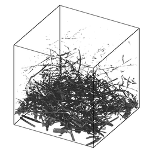

:orphan:

.. index:: fix_ablate

.. _fix-ablate:

.. _fix-ablate-command:

##################
fix ablate command
##################

.. _fix-ablate-syntax:

*******
Syntax:
*******

::

   fix ID ablate group-ID Nevery scale source maxrandom keyword value ...

- ID is documented in :ref:`fix<fix>` command 

- ablate = style name of this fix command

- group-ID = ID of group of grid cells that contain implicit surfaces

- Nevery = perform ablation once every Nevery steps

- scale = scale factor to convert source to grid corner point value decrement

- source = computeID or fixID or random

::

   computeID = c_ID or c_ID\[n\] for a compute that calculates per grid cell values
   fixID = f_ID or f_ID\[n\] for a fix that calculates per grid cell values
   v_name = per-grid vector calculated by a grid-style variable with name
   random = perform a random decrement

- maxrandom = maximum per grid cell decrement as an integer (only specified if source = random)

- zero or more keyword/value pairs may be appended

- keyword = *mindist*

::

   *mindist* value = fraction
   fraction = minimum fractional distance along cell edge for triangle/line vertices (value > 0 and < 0.5)

.. _fix-ablate-examples:

*********
Examples:
*********

::

   fix 1 ablate surfcells 1000 10.0 c_tally
   fix 1 ablate surfcells 0 0.0 random 10
   fix fablate ablate inner 0 0.2 random 0 mindist 0.02

.. _fix-ablate-descriptio:

************
Description:
************

Perform ablation once every Nevery steps on a set of grid cell corner
points to induce new implicit surface elements in those grid cells.
This command is also used as an argument to the
:ref:`read_isurf<read-isurf>` command so that the grid corner point
values it reads from a file can be assigned to and stored by each grid
cell.

Here are simulation snapshots of 2d and 3d implicit surface models
through which particles flow.  Click on any image for a larger image.
The 1st and 3rd images are the initial states of the porous media.
The 2nd and 4th images are snapshots midway through an ablation
simulation.  In the 2d case, the colorings are by processor for
sub-domains each owns.  Particles flow from left to right.  The
implicit triangles for the 3d case were created via Marching Cubes
(discussed on the :ref:`read_isurf<read-isurf>` command doc page) from
a tomographic image of a sample of NASA FiberForm (TM) material, used
as a heat shield material on spacecraft.  Particles flow from top to
bottom.

The specified *group-ID* must be the name of a grid cell group, as
defined by the :ref:`group grid<group>` command, which contains a set
of grid cells, all of which are the same size, and which comprise a
contiguous 3d array.  It must be the same as group-ID used with the
:ref:`read_isurf<read-isurf>` command, which specifies its *Nx* by *Ny*
by *Nz* extent.  See the :ref:`read_isurf<read-isurf>` command for more
details.  This command reads the initial values for grid cell corner
points, which are stored by this fix.

The specfied *Nevery* determines how often an ablation operation is
performed.  If *Nevery* = 0, ablation is never performed.  The grid
cell corner point values and the surface elements they induce will
remain static for the duration of subsequent simulations.

The specified *scale* is a pre-factor on the specified *source* of
ablation strength.  It converts the per grid cell numeric quantities
produced by the *source* (which may have associated units) to a
unitless decrement value for the grid cell corner points, which range
from 0 to 255 inclusive.  A value of 255 represents solid material and
a value of 0 is void (flow volume for particles).  Values in between
represent partially ablated material.

The *source* can be specified as a per grid cell quantity calculated
by a compute, fix, or variable.  For example, :ref:`compute isurf/grid<compute-isurf-grid>` can tally the number of collisions
of particles with the surfaces in each grid cell or the amount of
energy transferred to the surface by the collisions.  Or :ref:`compute react/isurf/grid<compute-isurf-grid>` can tally the number of
reactions that remove a species from the surface.

An example of a fix which be used as a *source* is 
:ref:`fix ave/grid<fix-ave-grid>` which could use either of those per grid
cell computes as input.  It could thus accumulate and time average the
same quantities over many timesteps.  In that case the *scale* factor
should account for applying a time-averaged quantity at an interval of
*N* steps.

Finally, a grid-style variable can be be used as a *source*.  This
could perform a calculation on other per grid cell quantities.  For
example, it could add and subtract columns from the compute or fix
just mentioned to tally adsorption versus desorption reactions and
thus infer net mass removed from the surface.

For debugging purposes, the *source* can also be specified as *random*
with an additional integer *maxrandom* value also specified.  In this
case, the *scale* factor should be floating point value between 0.0
and 1.0.  Each time ablation is performed, two random numbers are
generated for each grid cell.  The first is a random value between 0.0
and 1.0.  The second is a random integer between 1 and maxrandom.  If
the first random # < *scale*, then the second random integer is the
decrement value for the cell.  Thus *scale* is effectively the
fraction of grid cells whose corner point values are decremented.

See the explanation for the optional *mindist* keyword below.

Here is an example of commands that will couple ablation to surface
reaction statistics to modulate ablation of a set of implicit
surfaces.  These lines are taken from the
examples/ablation/in.ablation.3d.reactions input script:

::

   surf_collide	    1 diffuse 300.0 1.0
   surf_react	    2 prob air.surf

::

   compute             10 react/isurf/grid all 2
   fix                 10 ave/grid all 1 100 100 c_10\[\*\]
   dump                10 grid all 100 tmp.grid id c_10\[1\]

::

   global              surfs implicit
   fix                 ablate ablate all 100 2.0 c_10\[1\]   # could be f_10
   read_isurf          all 20 20 20 binary.21x21x21 99.5 ablate

::

   surf_modify         all collide 1 react 2

The order of these commands matter, so here is the explanation.

The :ref:`surf_modify<surf-modify>` command must come after the
:ref:`read_isurf<read-isurf>` command, because surfaces must exist
before assigning collision and reaction models to them.  The 
:ref:`fix ablate<fix-ablate>` command must come before the
:ref:`read_isurf<read-isurf>` command, since it uses the ID of the 
:ref:`fix ablate<fix-ablate>` command as an argument to create implicit surfaces.
The :ref:`fix ablate<fix-ablate>` command takes a compute or fix as an
argument, in this case the ID of the :ref:`compute react/isurf/grid<compute-react-isurf-grid>` command.  This is to
specify what calculation drives the ablation.  In this case, it is the
:ref:`compute react/isurf/grid<compute-react-isurf-grid>` command (or
could be the :ref:`fix ave/grid<fix-ave-grid>` command) which tallies
counts of surface reactions for implicit triangles in each grid cell.
The :ref:`compute react/isurf/grid<howto-computes-generate-values-output>` react/isurf/grid command
requires the ID of a surface reaction model, so that it knows the list
of possible reactions to tally.  In this case the reaction is set by
the :ref:`surf_react<surf-react>` command, which must therefore comes
near the beginning of this list of commands.

As explained on the :ref:`read_isurf<read-isurf>` doc page, the
marching cubes (3d) or marching squares (2d) algorithm is used to
convert a set of grid corner point values to a set of implicit
triangles in each grid cell which represent the current surface of
porous material which is undergoing dynamic ablation.  This uses a
threshold value, defined by the :ref:`read_isurf<read-isurf>` command,
to set the boundary between solid material and void.

The ablation operation decrements the corner point values of each grid
cell containing porous material.  The marching cubes or squares
algorithm is re-invoked on the new corner point values to create a new
set of implicit surfaces, which effectively recess due to the
decrement produced by the ablative *source* factor.

.. note::

  that each grid cell has 4
  (2d) or 8 (3d) corner point values.  Except at the boundary of the 2d
  of 3d array of grid cells containing porous materials, each corner
  point is similarly shared by 4 (2d) or 8 (3d) grid cells.

Within each grid cell, the decrement value is subtracted from the
smallest corner point value.  Except that a corner point value cannot
become smaller than 0.0.  If this would occur, only a portion of the
decrement is used to set the corner point to 0.0; the remainder is
applid to the next smallest corner point value.  And so forth on
successive corner points until all of the decrement is used.

The amount of decrement applied to each corner point is next shared
between all the grid cells (4 or 8) sharing each corner point value.
The sum of those decrements is subtracted from the corner point,
except that it's final value is set no smaller than 0.0.  All the
copies of each corner point value are now identical.

One issue with the marching cubes or squares algorithm is that it can
produce very tiny triangles (3d) or line segments (2d) when grid
corner point values are equal to or very close to the threshold value.

.. note::

  that this
  is on the scale of corner point values which can range from 0 to 255.

An alternate method for avoiding tiny triangles or line segments is to
use the *mindist* keyword.  For 3d models, its *fraction* value sets
the minimum fractional distance between any vertex of a triangle
generated by the marching cubes algorithm and any of the 8 corner
points of the grid cell.  For 2d models, it sets the minimum
fractional distance between any end point of a line segment generated
by the marching squares algorithm and any of the 4 corner points of
the grid cell.  Fractional means relative to the grid 
cell edge length.  I.e. if the grid cell size is 2.0 and *fraction* is 
0.1, then the fractional distance is 0.2.

The specified *fraction* value must be a number >= 0.0 and < 0.5.  If
the value is less than 1.0e-4, then it is treated as if the value were
(the default), and the epsilon method described above is used.

For values of fraction >= 1.0e-4, the "isosurface stuffing" method
proposed by Labelle and Shewchuk :ref:`(Labelle07)<Labelle07>` is used.
The idea is as follows:

If a generated triangle vertex or line segment end point could be
geometrically closer to a grid corner point than *fraction*, the value
of the grid corner point is adjusted to ensure the vertex/end-point
will always be at least a distance *fraction* from the corner point.
There are two cases to consider.

.. note::

  that this means the corner point is now effectively *outside* any
  generated surfaces rather than *inside*.  The grid corner point is set
  to a new value such that if another neighboring grid corner point
  value is 255.0, the generated vertex/end-point position between the 2
  corner points will be exactly a distance *fraction* away from the
  first grid corner point.

.. note::

  that this means the corner point remains
  above the threshold and *outside* any generated surfaces.  The grid corner
  point is set to a new value such that if another neighboring grid
  corner point value is 255.0, the generated vertex/end-point position
  bewteen the 2 corner points will be exactly a distance *fraction* away
  from the first grid corner point.

.. _fix-ablate-restart,-output-info:

*********************
Restart, output info:
*********************

No information about this fix is written to :ref:`binary restart files<restart>`.

This fix computes a global scalar and a global vector of length 2.
The global scalar is the current sum of unique corner point values
across the entire grid (not counting duplicate values).  This sum
assumes that corner point values are 0.0 on the boundary of the 2d or
3d array of grid cells containing implicit surface elements.

The 2 vector values are the (1) sum of decrement values for each grid
cell in the most recent ablation operation, and (2) the # of particles
deleted during the most recent ablation operation that ended up
"inside" the newly ablated surface.  The latter quantity should be 0.
A non-zero value indicates a corner case in the marching cubes or
marching squares algorithm the developers still need to address.

These values can be accessed by any command that uses global values
from a fix as input.  See :ref:`Section 6.4<howto-output-sparta-(stats,-dumps,>` for
an overview of SPARTA output options.

The scalar and vector values are unitless.

.. _fix-ablate-restrictio:

*************
Restrictions:
*************

This fix can only be used in simulations that define implicit surfaces.

.. _fix-ablate-related-commands:

*****************
Related commands:
*****************

:ref:`read isurf<read-isurf>`

.. _fix-ablate-default:

********
Default:
********

The default for the *mindist* keyword = 0.0, i.e. the epsilon method
is used.

.. _Labelle07:

**(Labelle07)** F. Labelle, and J. R.. Shewchuk, "Isosurface stuffing:
Fast Tetrahedral Meshes with Good Dihedral Angles," SIGGRAPH (2007).

