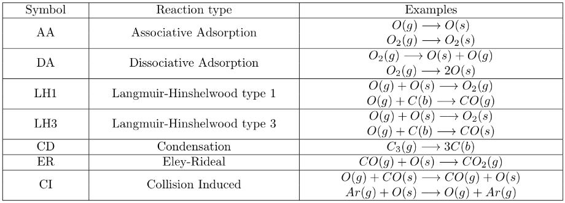
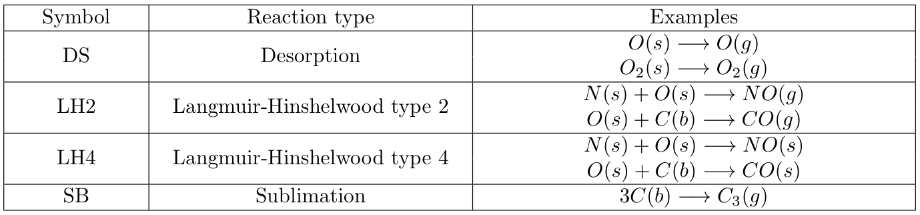

:orphan:

.. index:: surf_react_adsorb

.. _surf-react-adsorb:

.. _surf-react-adsorb-command:

#########################
surf_react adsorb command
#########################

.. _surf-react-adsorb-syntax:

*******
Syntax:
*******

::

   surf_react ID adsorb model infile(s) Nsync type temp n_sites adsp1 adsp2 ...

- ID = user-assigned name for the surface reaction model 

- style = *adsorb*

- model = *gs* or *ps* or *gs/ps*

::

   gs = gas-surface reactions
   ps = pure-surface reactions
   gs/ps = both gas-surface and pure-surface reactions

- infile(s) = file(s) with list of surface chemistry reactions

::

   one file for model *gs* or *ps*
   two files for model }gs/ps}, gs file first, ps file second

- Nsync = perform PS reactions and sync across processors every this many timesteps

- type = *face* or *surf*

::

   face = domain boundary treated as a surface
   surf = surface elements = triangles in 3d, lines in 2d

- temp = temperature of the surface n_sites = # of available adsorption sites per unit area (3D) or length (2D)

- adsp1,adsp2,... = list of species that can adsorb on surface

.. _surf-react-adsorb-examples:

*********
Examples:
*********

::

   surf_react adsorb gs gs_react.surf nsync 10 surf 1000 6.022e18 O CO
   surf_react adsorb gs/ps gs_react.surf ps_react.surf nsync 1 face 300 3e9 O

.. _surf-react-adsorb-descriptio:

************
Description:
************

Define a model for surface chemistry reactions to perform when
particles collide with surface elements or the global boundaries
(faces) of the simulation box, which enables the particles to adsorb
to the surface.  This model also has an option to encode chemical
reactions that can occur on the surface itself.

One or more models can be defined and assigned to different surfaces
or simulation box boundaries via the :ref:`surf_modify<surf-modify>` or
:ref:`bound_modify<bound-modify>` commands.  See :ref:`Section 6.9<howto-details-surfaces-sparta>` for more details of how SPARTA defines
surfaces as collections of geometric elements, triangles in 3d and
line segments in 2d.  Also see the :ref:`react<react>` command for
specification of a gas-phase chemistry reaction model.

The per-surface element species state computed and updated by this
command can be output via the :ref:`dump surf<dump>` command, using the
*s_name* syntax to output any of the 5 custom surface state variables
created by this surface reaction model.  They are as follows:

nstick_species = per-surf array with per-species counts
nstick_total = per-surf vector with total count of all species
area = per-surf area vector
weight = per-surf weight vector
tau = per-surf time-counter vector (see below)

See the examples/surf_react_adsorb dir for scripts that use this
surface reaction model.

The ID for a surface reaction model is used to identify it in other
commands.  Each surface reaction model ID must be unique.  The ID can
only contain alphanumeric characters and underscores.

In this *adsorb* style, gas particles can adsorb on the surface.
Adsorbed particles can then undergo reactions with other adsorbed
particles as well as with new gas-phase particles that strike the
surface.  Each surface element stores its "state" for the counts of
different particle species currently adsorbed on the element, which
alters the probablity for future reactions to take place.

When a particle adsorbs on the surface, a gas particle is deleted and
the number of adsorbed particles of that particular species is
incremented.  When a particle desorbs from the surface, a new gas
particle is created and the surface count is decremented.  The exact
location of the adsorbed particles is not stored; they are assumed to
uniformly distributed across the surface element.

One of three options is specified by the *model* keyword: *gs* or *ps*
or *gs/ps*.  This specifies one of two types of reactions to perform,
or both in the *gs/ps* case.

Gas-surface (GS) reactions involve both gas-phase and adsorbed/bulk
species as reactants.  Hence GS reactions occur when gas particles
collide with the surface.  Pure-surface (PS) reactions involve only
adsorbed/bulk reactants and do not include any gas-phase atoms or
molecules.  They are performed once every *Nsync* timesteps based on
the current surface coverage of the various adsorbed species.

For GS reactions, when a particle collides with a surface element or
boundary, the list of all reactions possible with that species as the
reactant is looped over.  A probability for each reaction is
calculated, using the formulas discussed below, and a random number is
used to decide which reaction (if any) takes place.  A check is made
that the sum of probabilities for all possible reactions is <= 1.0,
which should normally be the case if reasonable reaction coefficients
are defined.

For PS reactions, a time counter algorithm is used.  Each reaction has
a time counter *tau* that is increased by a value of *nsync\*timestep*
if all the reactants are available.  The rate for each reaction *R* is
computed based on the specified reaction rate constants as well as the
surface coverage of the reactants. The product of the rate *R* and
time counter *tau* is normalized to obtain the probability for each of
reaction; and a random number is used to decide which reaction occurs.
The chosen reaction is perforemd and its time counter is modified as
follows:

.. math:: \tau_{i} = \tau_{i} + \frac{log(Rn)}{R_{i}}

Next the probabilities of each reaction are recomputed and a new
reaction is chosen based on these probabilties and performed.  This
process is repeated till the probability of all the reactions reaches
zero. A detailed description can be found in Swaminathan Gopalan *et
al.* :ref:`(SG18)<SG18>`.

The infile argument(s) specify one or two filenames which contain a
list of GS or PS reactions and their associated parameters.  Two files
must be specified for the *gs/ps* model: a GS file first and a PS file
second.

The reactions are read into SPARTA and stored as a list.  Each time a
simulation is run the list is scanned, and only active reactions are
flagged.  In order for a reaction to be active, all the reactants and
all the products must be currently defined as species-IDs; and also
all the surface reactants and products must be present within the list
of species that are allowed to adsorb on the surface.  The list of
surface species is provided at the end of the surf_react adsorb
command via the adsp1, adsp2, etc arguments.

.. note::

  that this means the reaction file(s) can contain more reactions
  than are used in a particular simulation.

As explained below each reaction has a specified probability between
and 1.0.  That probability is used to choose which reaction (if
any) is performed.

The format of either a GS or PS reaction file is as follows.  Comments
or blank lines are allowed in the file.  Comment lines start with a
"#" character.  All other entries must come in 2 or more lines with
values separated by whitespace in the following format

::

   R1(g) + R2(s) + R3(b) --> P1(g) + P2(s) + P3(b)
   reaction-type reaction-style C1 C2 ... 
   scattering-model args

The first line is a text-based description of a single reaction. R1,
R2, and R3 are the reactants; while P1, P2, and P3 are the products
listed as a :ref:`species<species>` IDs.  The phase of the reactants
and products are species in the brackets immediately following the
species ID (no space).  It can be one of the following

::

   (g) - gas phase = gas particle striking or scattering from the surface
   (s) - surface phase = adsorbed particle present on the surface
   (b) - bulk phase = material which the surface is made of

For a GS reaction, R1 must be a gas-phase reactant.  I.e. the particle
species that collides with the surface/boundary.  For a PS reaction,
R1 must be an adsorbed or bulk-phase species.

Individual reactants and products must be separated by whitespace and
a "+" sign. The left-hand and right-hand sides of the equation must be
separated by whitespace and "-->".  The *type* of each reaction is a
string of characters (upper or lower case).  The different types of GS
and PS reactions are described below.

The allowed types for GS reactions is as follows:

AA = Associative Adsorption
DA = Dissociative Adsorption
LH1 = Langmuir-Hinshelwood mechanism of type 1
LH3 = Langmuir-Hinshelwood mechanism of type 3 
CD = Condensation reaction
ER = Eley-Rideal mechanism 
CI = Collision-induced reaction

An associative adsorption (AA) reaction means that R1(g) adsorbs on the
surface to form P1(s) when it collides with the surface/boundary.

A dissociative adsorption (DA) reaction means that R1(g) dissociates
when it collides with the surface/boundary. One or more of the
dissociated products can adsorb on the surface and the rest of them
scatter as gas-phase products.

A Langmuir-Hinshelwood reaction of type 1 (LH1) means that R1(g)
adsorbs on the surface when it collides with the surface/boundary, and
reacts quickly with the adsorbed species R2(s) or bulk-phase species
R2(b) on the surface to form gas-phase product P1(g).

A Langmuir-Hinshelwood reaction of type 3 (LH3) means that R1(g)
adsorbs on the surface when it collides with the surface/boundary, and
reacts quickly with the adsorbed species R2(s) or bulk-phase species
R2(b) on the surface to form adsorbed product P1(s).

A condensation reaction (CR) means that R1(g) coalesces with the bulk
material with which the surface is made of, when it collides with the
surface/boundary to form bulk-phase product P1(b).

An Eley-Rideal (ER) reaction means that R1(g) reacts quickly with
adsorbed species R2(s) or bulk species R2(b) when it collides with the
surface/boundary to form gas-phase product P1(g).

A collision-induced (CI) reaction means that R1(g) causes the
desorption of adsorbed species R2(s) when it collides with the
surface/boundary to form gas-phase products P1(g) (same species as
R2). The incident gas-phase particle can either adsorb P2(s) or
scatter from the surface P2(g) post collision.

A detailed description of the various types of reactions can be found
in Swaminathan Gopalan *et al.* :ref:`(SG18)<SG18>`.  Here is a table of
examples for each type of GS reaction.

The allowed types for  PS reactions is as follows:

DS = Desorption reaction
LH2 = Langmuir-Hinshelwood mechanism of type 2
LH4 = Langmuir-Hinshelwood mechanism of type 4 
SB = Sublimation reaction

A desorption reaction (DR) means that R1(s) desorbs from the surface
to form P1(g) whose final velocities are determined by the provided
scattering model.

A Langmuir-Hinshelwood reaction of type 2 (LH2) means that R1(s)
adsorbed on the surface reacts with another adsorbed species R2(s) or
bulk-phase species R2(b) on the surface to form gas-phase product
P1(g).

A Langmuir-Hinshelwood reaction of type 4 (LH4) means that R1(s)
adsorbed on the surface reacts with another adsorbed species R2(s) or
bulk-phase species R2(b) on the surface to form adsorbed product
P1(s).

A sublimation reaction (SR) means that R1(b), the bulk material
undergoes a transformation from solid to gas, to form gas-phase
product P1(g).

A detailed description of the various types of reactions can be found
in Swaminathan Gopalan *et al.* :ref:`(SG18)<SG18>`.  Here is a table of
examples for each type of PS reaction.

The *style* of each reaction is a single character (upper or lower
case) with the following meaning:

S = Simple
A = Arrhenius

.. important::

  The style of the reaction determines how many reaction
  coefficients are listed as C1, C2, etc, and how they are interpreted
  by SPARTA.

For S = Simple style, there is a single coefficient:

::

   C1 = direct value for the reaction rate constant

For A = Arrhenius style, there are three coefficients:

::

   A = pre-expoential factor 
   b = temperature exponent 
   Ea = activation energy for the reaction

The reaction rate constant is calculated in the following manner:

.. math:: K_{arrhenius}(T)  =  A T^b e^{-Ea/T }

For all the reactions types which includes adsorption - AA, DA, LH1,
LH3, and CD; the user must specify the number of species that adsorb
on the surface for the reaction as a argument after the reaction rate
coefficients

Additional optional keywords for GS reactions can be used to define
the reaction rate constant.  These are *kisliuk*: proposed by Kisliuk
:ref:`(Kisliuk57)<Kisliuk57>`; and *energy*: proposed by Beckerle *et al.*
:ref:`(Beckerle89)<Beckerle89>`.

*kisliuk* args = A_k B_k Ea_k (only for reactions which includes adsorption - AA, DA, LH1, LH3, and CD)

::

   *A_k* = pre-expoential factor
   *B_k* = temperature exponent
   *Ea_k* = activation energy for the adsorption

.. math::

   K_{kisliuk}(T)  =  A_k T^b_k e^{-Ea_k/T }
     K_{reac} = K_{arrhenius} * \frac{1-\Theta}{1-\Theta+K_{kisliuk}\Theta}

*energy* args = m n (only for CI)

::

   *m* = energy exponent
   *n* = polar angle exponent

.. math:: K_{reac} = K_{arrhenius} * \left(E_{i}\right)^{m} * cos^{n}\left(\theta\right)

The final rate of the reaction is computed by the product of the
reaction rate constant and the surface coverage of all the adsorbed
reactants. The reaction probability is obtained by normalized all the
reaction rates. A detailed description can be found in Swaminathan
Gopalan *et al.* :ref:`(SG18)<SG18>`.

If there are gas-phase products, there is an option to specify the
model used to compute how the particle(s) scatter from the surface for
this reaction.  This will override the surface collision model
assigned to the surface element using the
:ref:`surf_collide<surf-collide>` command.  If no reaction-specific
scattering model is desired, specify a *NULL* value.

Any of the following surface collision models can be used: *specular*,
*diffuse*, *adiabatic*, *cll*, *impulsive*, *td*.  The scattering
model style and its corresponding arguments are specified in the line
following the reaction-style.  If there are two gas-phase products,
two lines (for the first and second particle) can be specified.  The
arguments for the different surface scattering models are the same as
specified in the :ref:`surf_collide<surf-collide>` command.

.. _surf-react-adsorb-output-info:

************
Output info:
************

All the surface reaction models calculate a global vector of values.
The values can be used by the :ref:`stats_style<stats-style>` command
and by :ref:`variables<variable>` that define formulas.  The latter
means they can be used by any command that uses a variable as input,
e.g. the :ref:`fix ave/time<fix-ave-time>` command.  See :ref:`Section 4.4<howto-output-sparta-(stats,-dumps,>` for an overview of SPARTA output
options.

.. note::

  that this count includes all reactions in the files, not
  just the ones flagged as active for a particular simulation.

The first element of the vector is the count of particles that
performed surface reactions for surface elements assigned to this
reaction model during the current timestep. The second element is the
cummulative count of particles that have performed reactions since the
beginning of the current run.  The next nlist elements are the count
of each individual reaction that occurred during the current timestep.
The final nlist elements are the cummulative count of each individual
reaction since the beginning of the current run.

.. _surf-react-adsorb-restrictio:

*************
Restrictions:
*************

If the following conditions are met:

this reaction model is assigned to surface elements
on-surface PS reactions are defined
surface elements are distributed across processors
the :ref:`fix balance<fix-balance>` or :ref:`fix adapt<fix-adapt>` command is used

then the timesteps on which balancing or grid adaptation are performed
must be multiples of *Nsync*.  This is because surfaces are
re-assigned to processors due to the change in the grid assignment to
processors and the per-surface *tau* values must be upated
appropriately when that occurs.

.. _surf-react-adsorb-related-commands:

*****************
Related commands:
*****************

:ref:`surf_react<aurf-react>`, :ref:`react<react>`, 
:ref:`surf_modify<surf-modify>`,
:ref:`bound_modify<bound-modify>`,

.. _surf-react-adsorb-default:

********
Default:
********

none

.. _SG18:

**(SG18)** K. Swaminathan Gopalan, "Development of a detailed surface
chemistry framework in DSMC", AIAA Aerospace Sciences Meeting, Jan
(2018).

.. _Kisliuk57:

**(Kisliuk57)** P. Kisliuk, "The sticking probabilities of gases
chemisorbed on the surfaces of solids", Journal of Physics and
Chemistry of Solids, vol. 3, no. 1-2, pp. 95-101, 1957.

.. _Beckerle89:

**(Beckerle89)** J. Beckerle, A. Johnson, and S. Ceyer, "Observation and
mechanism of collision-induced desorption: CH4 on Ni (111)", Physical
Review Letters, vol. 62, no. 6, p. 685, 1989.

